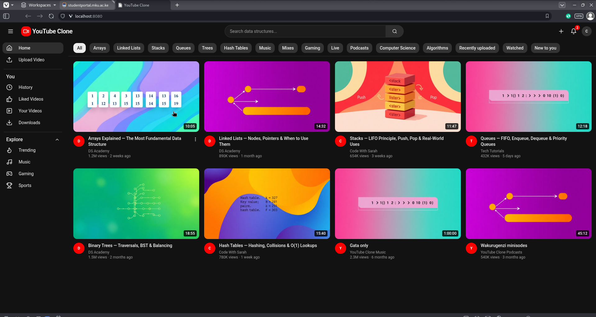
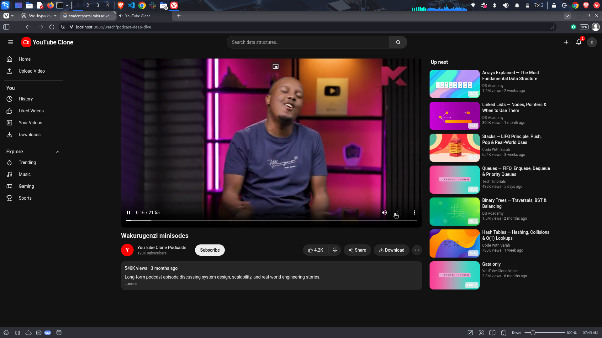
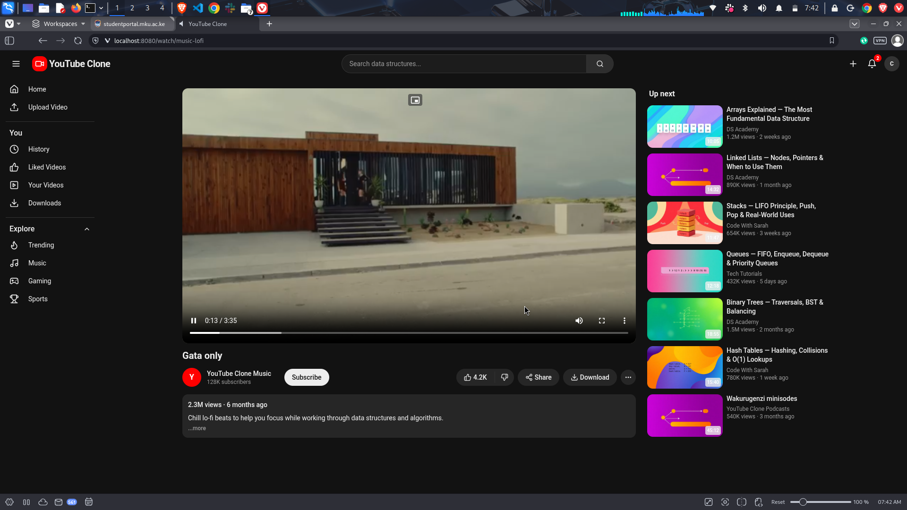
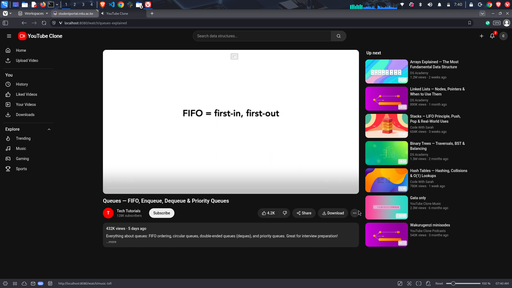
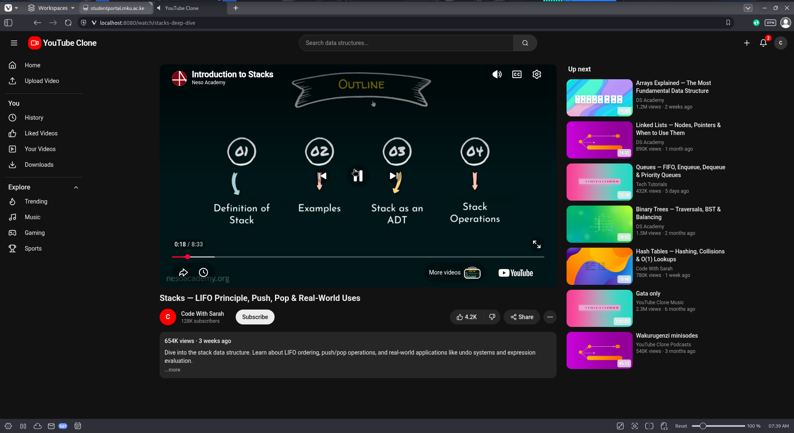
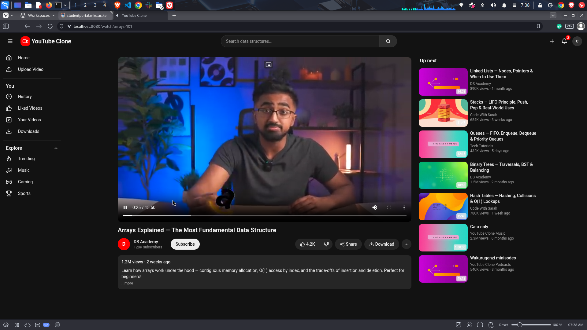
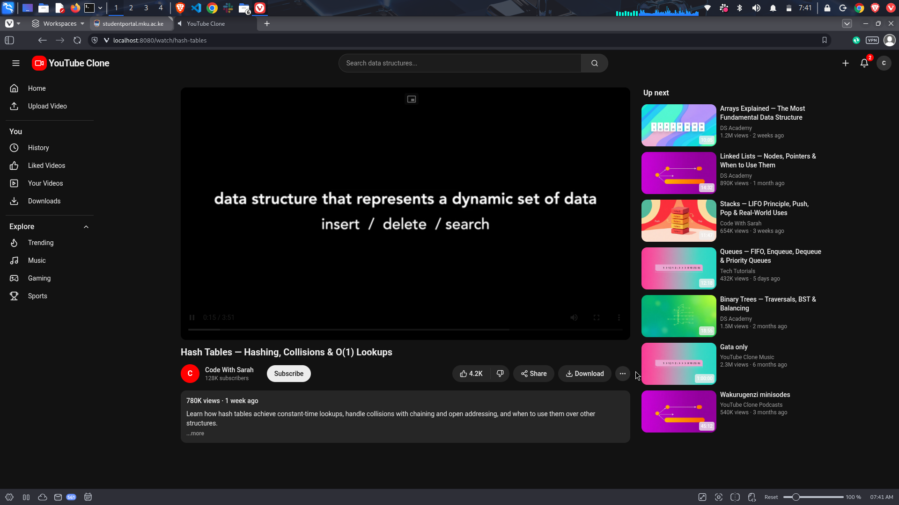
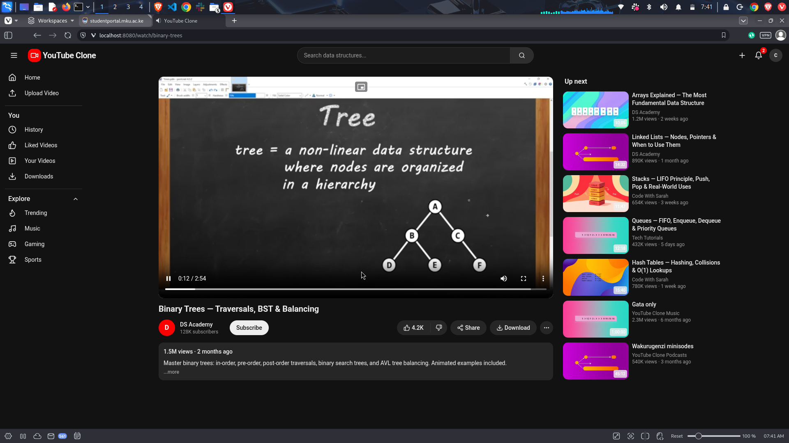

# BIT2203 YouTube Clone Group Project

This repository now has two main parts:

- `project/` – the YouTube clone application (all source code, config, and assets)
- `Group members/` – the group members list and admission numbers

To run the app locally:

1. `cd project`
2. Install dependencies (if not already): `npm install` or `bun install`
3. Start the dev server: `npm run dev` or `bun dev`

All existing code and data have simply been moved under `project/` so functionality remains the same.

## Screenshots (Project Working)

Home / launch page:

Sample video pages:

Data structure content examples:

